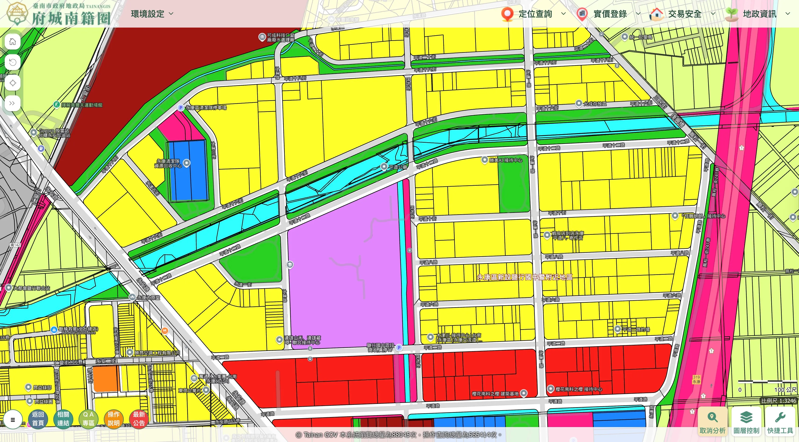

---

layout: default
title: 鹽行國中重劃區觀測站：平台定位與內容架構說明（2026）
description: 鹽行國中重劃區觀測站的觀測方向與核心方法，說明本站的定位、架構與價值。
permalink: /vision/
image: /assets/img/vision/zoningmap.webp

---

# 鹽行國中重劃區觀測站：平台定位與內容架構說明（2026）

## 轉型宣言

2025 年 9 月，本站起初在 Facebook 建立粉絲專頁，開始累積素材庫，記錄本重劃區的環境資訊現場，並在 instagram / Threads / YouTube 平台，以「**yanhangwatch**」為對外傳播管道。

回顧這幾個月，我終於理解：單一議題，已不足以描述這裡正在發生的事。我本來只是在看區段環境，但後來我也注意到：城市敘事的同質性過高，且區域資訊透明度亦有提升空間。

這裡不負責動員，也不負責包裝。我只是站在路邊的一名觀測者，把所見所聞如實記錄下來。本站先前已調整名稱為「鹽行國中重劃區觀測站」，觀測範圍不再侷限於環資而已。

2025 年 12 月，觀測站的 GitHub Pages 正式成立。基於社群平台屬性不同，本站將視文本內容，酌予調整發佈形式，以確保與平台風格契合。

---

## 核心價值

這片區域的故事，不限於交通、綠地與水域。它同時來自地景變遷、歷史痕跡、交通路廊，以及那些我們以為理所當然、長期存在——卻很少被完整說明的設施。

隱性的居住成本，往往被渲染成「城市亮點」；而真正影響判斷的關鍵，卻可能逐漸淡出視野。與生活密切相關的資訊，反覆被遮蓋、擠壓、抽離，這不是過去式，而是現在進行式。

當別人擅長說故事，那就需要有人把沒被說完的那一頁補上。這裡提供對等資訊、對等敘事，未來也會秉持「**資訊永續**」的精神，期盼帶給區段正向發展。

---

## 架構說明

### 🔎 微觀｜設施與地景的實地觀測

以實地拍攝、地圖定位與公開資料，記錄重劃區周邊設施的位置、規模與日常運作情形。

### 🔭 宏觀｜制度、數據與都市結構

透過人口密度、土地使用分區等大尺度資料，解析本區在台南都市結構中的定位。

### 🗣️ 鹽論｜資訊透明與公共知情權

整理關於資訊透明、制度風險與公共知情權的觀測筆記。

### 🔙 時間檔案｜重要歷史事件回顧

帶領讀者回顧過去，盼能跨越時間維度，找回散落在網路邊陲的故事。

---

## 結語

有些設施，也許不想被看見；有些品牌，或許也不習慣被完整理解。真正敏感的，往往不是設施本身，而是有人不希望你知道它的存在。展望 2026 年，我選擇讓資訊留下，再讓市場自己決定。

首次張貼日：2025/12/28（最後更新日：2026/02/27）

---

[← 返回觀測站首頁](/)

> 本站內容整理自公開資料與實地觀察，部分圖像與資料出處為政府公開資訊，經整理重製使用，僅供資訊紀錄與研究參考，不構成投資、購屋或任何形式之建議，亦不代表任何機關立場。實際情況請以政府機關公告與正式文件為準。
